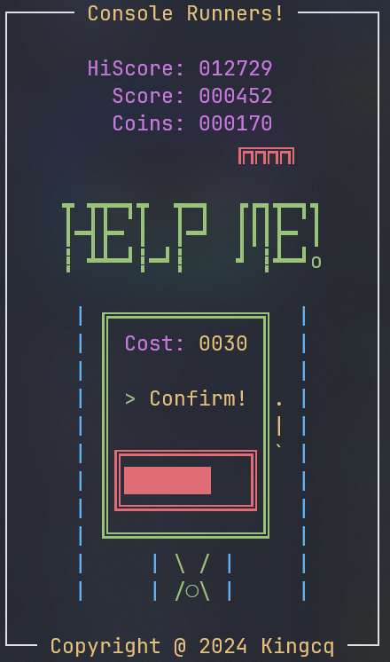

<div align="center">

# Console Runners

#### ✨ A Simple Parkour Game in Terminal ✨

</div>

_Console Runners_ is a text-based parkour game written in C. It is designed quite similar to the famous parkour game _Subway Surfers_. Instead of focusing on visual expression, this project is more lightweight and can be played in almost any terminal that supports ANSI color.

This project aims to learn more about features of C and how to make a game using these features. It is also completed as a course project.

Any feedback on this project would be appreciated.

## Features

- 🚀 Lightweight and runs extremely smooth
- 🎮 Easy and fun to play
- 🎨 Colorful and carefully designed user interface
- ✨ Runs perfectly with Windows and Unix-like operating systems
- ⌨ Attentively coded and easy-to-understand
- 🔨 Easy to build and run
- 🧑‍🏫 With a chinese tutorial about how to make game like this
- 🎁 Free and open-source

## Prerequisites
- Basic knowledge of C
- Git command-line tool
- A C compiler

## Installation
Clone this project:
```sh
git clone https://github.com/Kingcxp/Console-Runners.git ConsoleRunners/
```
Enter the project source file directory:
```sh
cd console-runners/
```
Compile the project(Use gcc as example):
```sh
gcc src/main.c -std=c11 -lm -o ConsoleRunners
```
Run the project and enjoy it:
```sh
./ConsoleRunners
```

__Or you can build it by cmake:__
```sh
mkdir build && cd build
cmake ..
make
./ConsoleRunners
```

## Licence
```
MIT License

Copyright (c) 2024 Qi Chen

Permission is hereby granted, free of charge, to any person obtaining a copy
of this software and associated documentation files (the "Software"), to deal
in the Software without restriction, including without limitation the rights
to use, copy, modify, merge, publish, distribute, sublicense, and/or sell
copies of the Software, and to permit persons to whom the Software is
furnished to do so, subject to the following conditions:

The above copyright notice and this permission notice shall be included in all
copies or substantial portions of the Software.

THE SOFTWARE IS PROVIDED "AS IS", WITHOUT WARRANTY OF ANY KIND, EXPRESS OR
IMPLIED, INCLUDING BUT NOT LIMITED TO THE WARRANTIES OF MERCHANTABILITY,
FITNESS FOR A PARTICULAR PURPOSE AND NONINFRINGEMENT. IN NO EVENT SHALL THE
AUTHORS OR COPYRIGHT HOLDERS BE LIABLE FOR ANY CLAIM, DAMAGES OR OTHER
LIABILITY, WHETHER IN AN ACTION OF CONTRACT, TORT OR OTHERWISE, ARISING FROM,
OUT OF OR IN CONNECTION WITH THE SOFTWARE OR THE USE OR OTHER DEALINGS IN THE
SOFTWARE.
```

## ScreenShots




